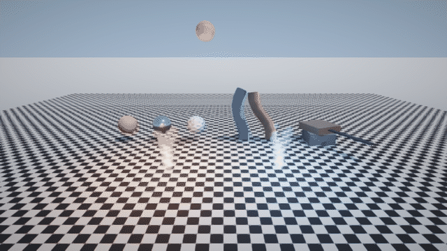
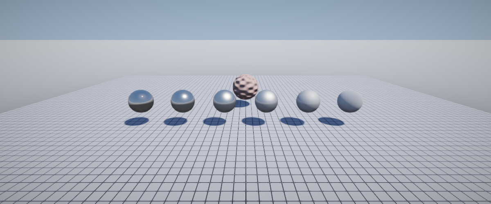
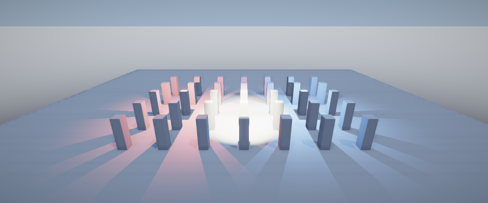
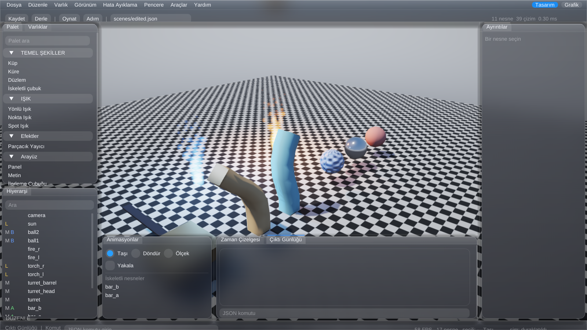

<div align="center">

# ali-engine

### An engine for all.

**Yapay zekânın baştan sona yönetebildiği 3D oyun motoru.**
Bir ajan sahneyi kurar, oyunu oynatır, çıkan kareyi *görür* ve düzeltir.
İnsan da aynı veriyi Unreal tarzı bir editörden ve Blueprint görsel betikten yönetir.




<sub>Bu klipteki her nesne, ışık, malzeme, parçacık ve davranış JSON komutlarıyla yaratıldı ve başsız (headless) render edildi. Sahne için tek satır C++ yazılmadı.</sub>

</div>

---

## Manifesto

Oyun motorları insanlar için, fare ve panel düşünülerek yapıldı. **ali-engine önce yapay zekâ için yapıldı**: sahneyi kur, ışığı yerleştir, oyun kurallarını yaz, simülasyonu ilerlet, **kareyi görüntü olarak geri al**, gördüğüne göre tekrar dene.

> Her şey veridir. Sahne JSON. Davranış JSON. Kontrol yüzeyi satır satır JSON komutu.

Bu yüzden ali-engine:

- **Yapay zekâ-yerlisi.** Model komut yollar, ekran görüntüsü ve yapısal durum okur.
- **Deterministik.** Aynı sahne + aynı komutlar = aynı sonuç (sabit adımlı simülasyon).
- **Başsız çalışır.** Pencere olmadan render ve ekran görüntüsü (CI ve ajan döngüleri için).
- **İnsana da açık.** Editör ve Blueprint, yapay zekânın kullandığı *aynı komutları ve aynı JSON'u* üretir. İnsan ve yapay zekâ tek bir oyun üzerinde birlikte çalışır.

## Bir bakışta

| Malzemeler | Işıklar |
| --- | --- |
|  |  |

<div align="center">
<br>
<sub><code>--editor</code>: canlı 3D sahne pencerenin arka planı, paneller üstünde yüzen buzlu cam kartlar. Arayüz Türkçe ve İngilizce.</sub>
</div>

## Döngü

```jsonc
> {"method":"scene.load","params":{"path":"scenes/showcase.json"}}
> {"method":"world.step","params":{"dt":0.016,"steps":180}}
> {"method":"observe.screenshot","params":{"path":"out.png"}}
< {"ok":true,"result":{"path":"out.png","width":1280,"height":720}}
```

Yaz, oku, **gör**. Komut referansı: [`docs/AI-PROTOCOL.md`](docs/AI-PROTOCOL.md).

## Nasıl denerim?

```bash
cmake -B build -G Ninja -DCMAKE_BUILD_TYPE=Release && cmake --build build
build/engine --headless --scene scenes/showcase.json   # ekranı olmayan makinede: xvfb-run ile
build/engine --editor --scene scenes/showcase.json     # insan arayüzü
```

Ayrıntılı bağımlılıklar için bkz. depo README'si. Windows x64 için hazır sürüm: [Releases](https://github.com/macbyclp/ali-engine/releases/latest).

## Neden var?

Godot ve Unreal olgunlukta, ekosistemde ve platform desteğinde önde. ali-engine tek bir iş akışına odaklı: **"Yapay zekâ oyunu üretsin, insan gözden geçirip düzeltsin."** Bu iş akışı için kontrol yüzeyi, yapısal gözlem ve Blueprint köprüsü hazır. Karşılaştırma: [`docs/vs-godot.md`](docs/vs-godot.md).

<div align="center"><b>An engine for all.</b></div>

---

English detailed reference (previous README): [`docs/README-detailed-en.md`](docs/README-detailed-en.md)
