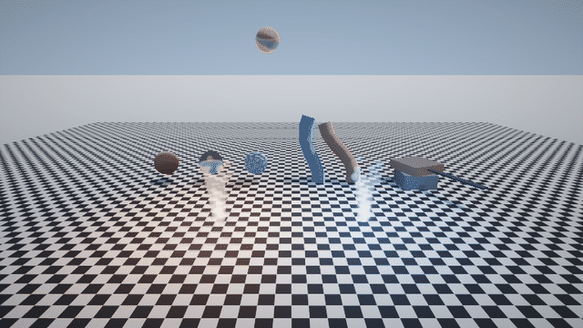
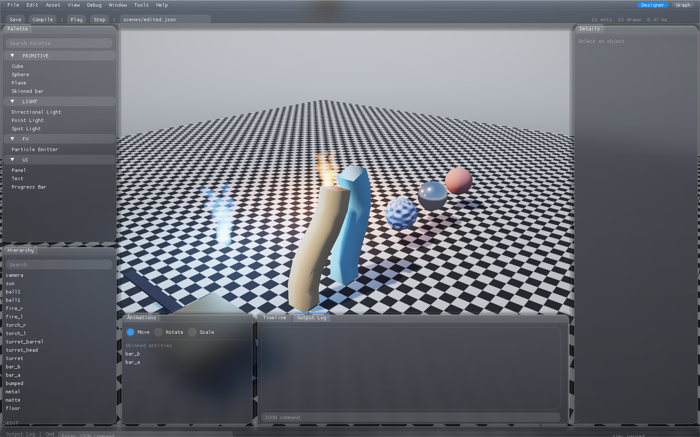
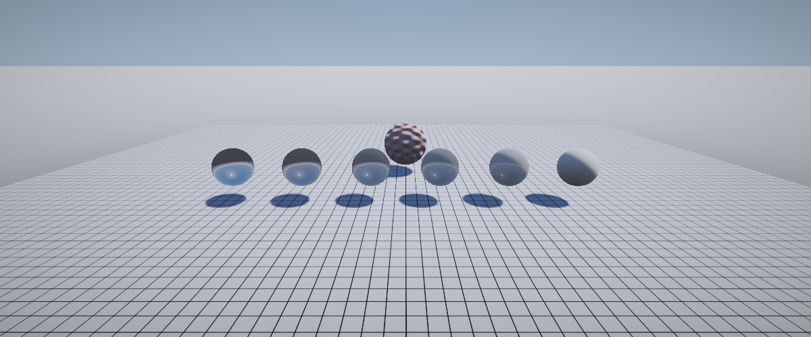
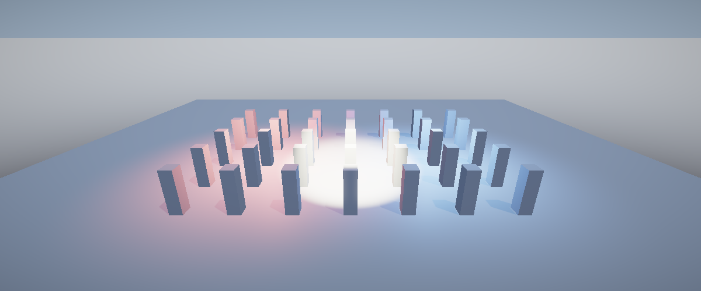

<div align="center">

# ali-engine

**An AI-native 3D game engine.**
An AI agent builds and runs the whole game over a JSON command stream.
Humans get an Unreal-style editor and Blueprint-style visual scripting on top —
same data model, no separate export step.

`C++20` · `OpenGL 4.5` · `Windows`

[**Download v0.1.0 (Windows x64)**](https://github.com/macbyclp/ali-engine/releases/latest) · [Command reference](docs/AI-PROTOCOL.md) · [Architecture](ARCHITECTURE.md)



<sub>Every object, light, material, particle and behaviour in that clip was created by JSON commands and rendered headless — no C++ was written for the scene.</sub>

</div>

---

## The idea

Most engines are built for a human in an editor. ali-engine is built so an **AI agent
can drive the entire loop**: create a scene, place lights and cameras, wire up gameplay
rules, step the simulation, and **get the rendered frame back as an image** to reason
about — then iterate.

Everything is data. The scene is JSON. Behaviours are JSON. The control surface is
~49 line-delimited JSON commands on stdin/stdout. That makes the engine:

- **AI-native** — a model emits commands, reads back screenshots and structured state
- **Deterministic** — same scene + same commands → same result; fixed-step simulation
- **Headless-first** — full rendering and screenshots with no window (CI, agent loops)
- **Human-friendly too** — the ImGui editor and the Blueprint graph produce the *same*
  commands and JSON the AI uses. A human and an AI can work on one game, one shared model.

```
              ┌──────────────┐   JSON commands (stdin)    ┌────────────┐
   AI agent ──┤              ├──────────────────────────► │            │
              │  your code   │ ◄──────────────────────────┤ ali-engine │
   or human ──┤              │   screenshots + state      │            │
              └──────────────┘                            └────────────┘
                    ▲                                            │
                    └──────────  GUI editor / Blueprint  ────────┘
```

---

## Features

**Rendering**
- Metallic-roughness PBR (Cook-Torrance), procedural-sky IBL approximation
- 3-cascade shadow maps (frustum-fit, texel-snapped, PCF)
- HDR pipeline: RGBA16F target, ACES tonemap, bloom, exposure, vignette
- Point / spot lights (forward, up to 16), attenuation, soft spot cones
- Textures: albedo / normal / metallic-roughness / emissive / AO, mipmaps, anisotropy
- glTF 2.0 import — meshes, materials (incl. embedded `.glb` textures), skins, animations
- GPU instancing by mesh+material · job-parallel frustum culling · 2000+ objects in 2 draw calls

**Simulation & gameplay**
- Jolt Physics — rigid bodies, ray casts, contact events, `CharacterVirtual` controller
- Grid navmesh + 8-way A* pathfinding
- Skeletal animation — clip playback, TRS-level cross-fade, GPU skinning (128 bones)
- Data-driven behaviours — `on: start/tick/collision/event` → actions, conditions, timers
- Global game state store, checkpoints (`checkpoint.save/restore`)
- CPU particle system (additive billboards), spatial audio (miniaudio)
- Screen-space UI — panels, text (stb_truetype), bars, 9 anchors

**Tooling**
- `--editor` — embedded Dear ImGui editor, laid out after Unreal's UMG editor,
  in an Apple-style liquid-glass skin: the live 3D scene is the full-window
  backdrop, panels are frosted-glass cards floating over it
- ImGuizmo transform gizmos, orbit-camera viewport, live JSON console
- `--shot <file.png> [--shot-frame N]` — grab the composited window to PNG, then quit
- **Blueprint visual scripting** — node graph that compiles to behaviour JSON, and
  round-trips *from* it (see below)

<div align="center">
<br>
<sub>The <code>--editor</code> view — liquid-glass panels over the live viewport: Palette · Hierarchy · Details · Animations · Timeline · Output Log</sub>
</div>

| Materials — roughness sweep + normal map | Point + spot lights |
| --- | --- |
|  |  |

---

## Quick start

**Prebuilt:** grab [`ali-engine-v0.1.0-win64.zip`](https://github.com/macbyclp/ali-engine/releases/latest)
(≈2 MB, VC++ runtime bundled) and jump to *Run* below.

**Build from source** — CMake ≥ 3.24, Visual Studio 2022 (Desktop C++ workload), Python + `jinja2`
(for the GL loader codegen).

```bash
py -m pip install jinja2
cmake -B build -G "Visual Studio 17 2022" -A x64
cmake --build build --config Debug
```

All third-party libraries (GLFW, GLM, EnTT, nlohmann/json, Jolt, cgltf, stb, miniaudio,
Dear ImGui, ImGuizmo, imgui-node-editor) are fetched by CMake — no manual setup.

**Run:**

```bash
# headless — the AI-driving mode
build\Debug\engine.exe --headless --scene scenes/showcase.json

# visible window, physics running
build\Debug\engine.exe --scene scenes/showcase.json --play

# full editor
build\Debug\engine.exe --editor --scene scenes/showcase.json

# example AI driver (spawns a scene, steps it, screenshots, quits)
python tools/drive.py
```

---

## The control loop

The engine reads one JSON request per line and answers with one JSON response.
Logs go to stderr, so stdout stays a clean channel.

```jsonc
> {"method":"scene.reset"}
< {"ok":true,"result":{}}

> {"method":"entity.spawn","params":{"name":"ball","primitive":"sphere",
    "position":[0,5,0],"metallic":1.0,"roughness":0.15,
    "body":{"type":"dynamic","restitution":0.8}}}
< {"ok":true,"result":{"name":"ball"}}

> {"method":"behavior.set","params":{"name":"ball","behaviors":[
    {"on":"collision","with":"floor","do":[
      {"action":"addState","key":"bounces","value":1},
      {"action":"impulse","impulse":[0,6,0]}]}]}}
< {"ok":true,"result":{}}

> {"method":"world.step","params":{"dt":0.016,"steps":180}}
> {"method":"observe.screenshot","params":{"path":"out.png"}}
< {"ok":true,"result":{"path":"out.png","width":1280,"height":720}}

> {"method":"observe.entities"}          // screen-space positions + visibility for reasoning
> {"method":"observe.view","params":{"position":[10,3,0],"target":[0,1,0]}}   // free camera, scene camera untouched
```

Full command reference: [`docs/AI-PROTOCOL.md`](docs/AI-PROTOCOL.md).

---

## AI writes it, a human sees it as Blueprint

Behaviours the AI authors (`behavior.set`, or in the scene JSON) are stored as rules.
Open the editor, switch to **Graph** mode, select the entity — the Blueprint editor
reconstructs those rules as a node graph:

- each `on:` rule → an **event node** (On Start / On Collision / On Event…)
- each action → an **action node** (Impulse, Add State, Set Color, Emit, Timer…)
- chained by exec pins in order

Edit the nodes, hit **Compile**, and it writes the JSON back. Round-trip: AI ⇄ visual graph
⇄ the same data.

---

## Architecture

```
src/
  core/        window (GL 4.5, headless), job system, logging
  render/      PBR renderer, CSM, bloom, framebuffers, meshes, shaders
  physics/     Jolt wrapper, ECS↔physics bridge, character controller
  anim/        skeleton, clip sampling, cross-fade, GPU skin matrices
  scene/       EnTT registry ⇄ JSON, hierarchy / world transforms, prefabs
  ecs/         component definitions
  behavior/    data-driven behaviour interpreter
  nav/         grid navmesh + A*
  fx/          particle simulation
  audio/       miniaudio engine wrapper
  ui/          bitmap font atlas, screen-space UI
  game/        global state, timers
  aicontrol/   stdin/stdout JSON channel, command dispatch
  editor/      ImGui editor, Unreal-style theme, Blueprint graph
  main.cpp     modes: headless · window · --editor
```

Design principles: headless always works · determinism · everything serialises to JSON ·
one command path (the AI console, the editor and the Blueprint compiler all call it).
See [`ARCHITECTURE.md`](ARCHITECTURE.md).

---

## vs. Godot / Unreal

Not a replacement for a mature general-purpose engine — Godot and Unreal win on
maturity, ecosystem, platform reach and per-subsystem depth (GI, terrain, full navmesh,
blend trees, asset editors).

Where ali-engine leads, for its purpose:

1. **AI-native control surface** — deterministic, headless, structured observation
2. **Built-in visual scripting** — Godot 4 shipped without any
3. **One shared model** — an AI and a human can build the same game together, one via
   commands, one via the editor / Blueprint

If the workflow is "AI generates the game, a human reviews and tweaks it," this engine is
built for exactly that.

---

## Roadmap

Done: core · PBR + CSM · Jolt physics · behaviours · culling/instancing · textures ·
scene graph + prefabs · skeletal animation + blend · point/spot lights · character +
navigation · particles/audio/post · UI + text · AI observation + gameplay layer ·
Unreal-style editor · Blueprint visual scripting.

Deferred / next: Vulkan RHI · spot & point shadows · animation state machine · terrain ·
SSAO · Recast navmesh · procedural mesh / CSG · audio buses · plugin / module API.

## License

MIT — see [`LICENSE`](LICENSE).
